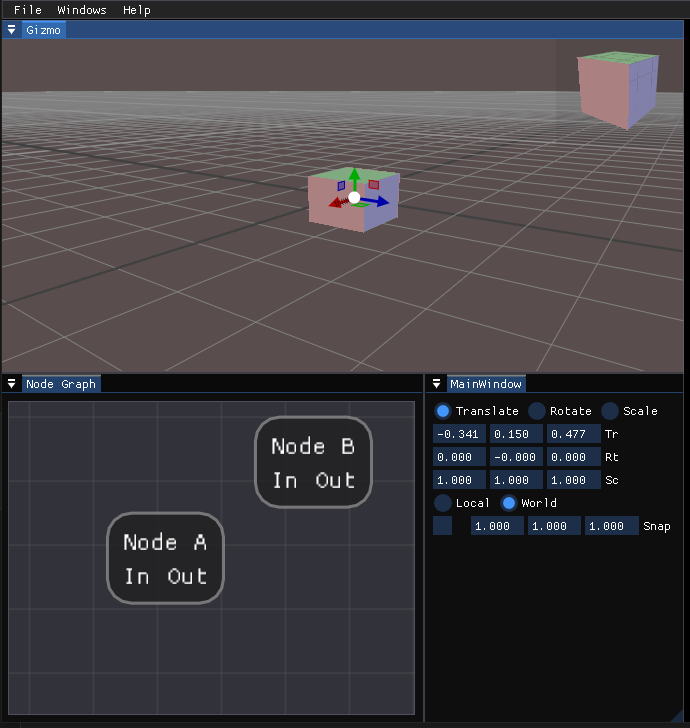

# WIP - 3D level editor

3D editor framework aimed at game level design or visual effect creation.

Planned features:
* UI reactive state
* Node graph system
* Scripting API 



## Requirements

* C++ 20
* CMake
* Boost (see Third party dependencies)

## Build on Windows

```bash
git clone https://github.com/lzubiaur/dkey.git
git submodule update --init --recursive
mkdir build && cd build
cmake -S .. -Wno-dev -G "Visual Studio 17 2022" -T ClangCL
cmake --build . 
```

## Third party dependencies

* catch: unit testing
* boost di - should be removed and use the boost distribution instead
* entt - entity component library (Planned)
* fruit - DI from google
* gl3w - OpenGL core profile loading
* glfw - manage windows and OpenGL contexts
* GSL - Microsoft Guidelines Support Library
* ImGui - Immediate mode UI
* ImGui Node graph
* ImGuizmo
* ImPlot
* spdlog
* squirrel
* `boost 1.86.0` - headers distribution must be installed manually
